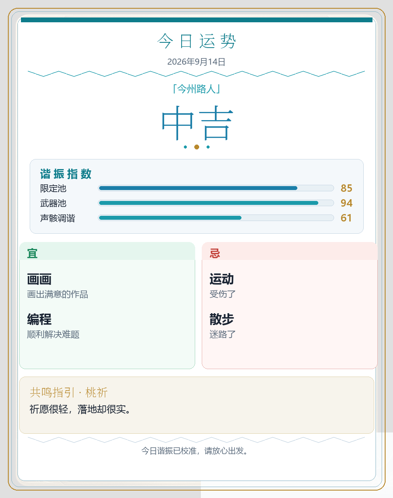

# nonebot-plugin-wuwa-luck / astrbot-plugin-wuwa-luck

鸣潮主题「今日运势」白底卡片。支持 **NoneBot2** 与 **AstrBot** 两端。

## 示例




## 指令

- `/luck`
- `/今日运势`

## NoneBot2 安装

```powershell
# clone 到插件目录（仓库根目录即 NoneBot 插件）
git clone https://github.com/baichui/wuwa_luck.git src/plugins/wuwa_luck
```

依赖：`nonebot2`、`nonebot-adapter-onebot`、`Pillow`。

### 配置

插件目录下的 `config.json`（首次运行会自动生成）：

```json
{
  "wuwa_deed_chance": 0.3,
  "metric_labels": [],
  "character_weights": {
    "小爱": 80,
    "今汐": 1,
    "长离": 1
  }
}
```

- `character_weights`：0=不出现；概率=权重/总和  
- `wuwa_deed_chance`：宜忌里出现鸣潮文案的概率（全卡最多 1 条）  
- `metric_labels`：谐振指数条目，空则默认「限定池/武器池/声骸调谐」

改完 `config.json` 保存即可，无需重启（每次 `/luck` 重新读取）。

## AstrBot 安装

把本仓库的 `astrbot/` 目录复制到：

```
<AstrBot>/data/plugins/wuwa_luck/
```

或：

```powershell
git clone https://github.com/baichui/wuwa_luck.git
# 再把 astrbot/ 内容拷到 data/plugins/wuwa_luck
```

WebUI → 插件配置可调：

- 各角色出现权重（0–100）
- 宜忌鸣潮概率
- 谐振指数条目

## 说明

- 基于洛谷运势修改：[plugin-luoguluck](https://github.com/LiteSuggarDEV/plugin-luoguluck)
- 同 UID + 昵称 + 日期当天结果固定
- 共鸣指引：小爱（爱弥斯）默认权重 80，其余角色默认 1
- 主角色语录 5 条；漂泊者多属性已合并
- 字体优先系统字体（Windows：`C:\Windows\Fonts`）
